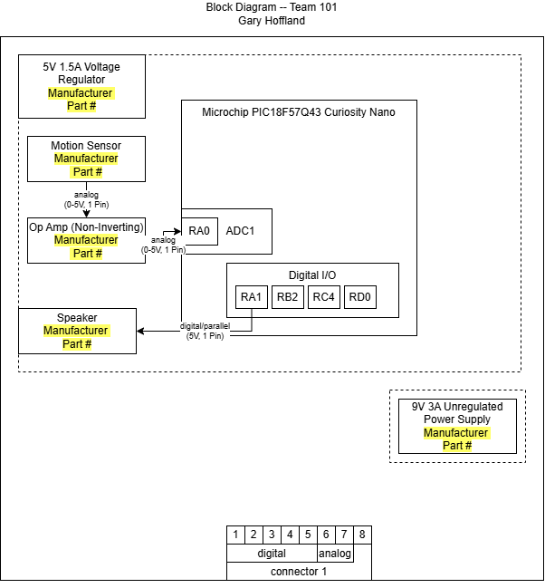

## Overview
A block diagram defines the system architecture of a circuit by mapping signal and power pathways across the design. The diagram identifies the system power source and distributed power levels, maps the signal integration of all sensors and actuators, and highlights key team connections for the addition of other subsystems. 

## Block Diagram 

